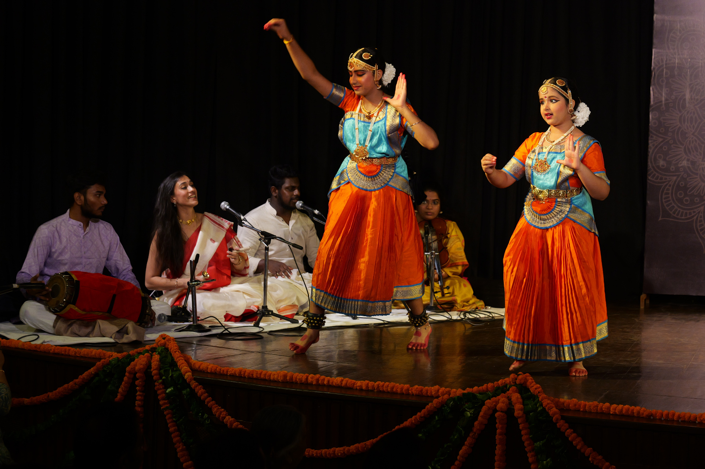

In 2025, we were delighted to be joined by [**Ms. Uma Arun**](#uma_arun), [**Shri M. Sridhar**](#m_sridhar) and [**Shri G. Swaminathan**](#g_swaminathan) as accompanists for Saadhana 2025's group and solo dance performances.
### Glimpses from the accompanists' felicitation

 
### Glimpses from group and solo performances

  
  
  
  
  
  
  
  
  
  
  
  
  


 
## Uma Arun [](https://instagram.com/uma_arun.30)

**Uma Arun** is a Violinist from Delhi. She was initiated into the art of Violin at age 12, under the able guidance of **Guru Kalaimamani Shri VSK Chakrapani** and **Guru Shri Delhi R. Sridhar**.
 

**Her passion for the Violin made her renounce her corporate job to completely devote herself to music.**
 

Uma is pursuing a Ph.D. in Carnatic Music from the Faculty of Music, University of Delhi. She has **performed across India and the world**, and graced the stage extensively as a soloist and accompanist under many prestigious banners.
 

She regularly **assists her Guru in classes**, and also has numerous students learning under her.


_Follow **Uma Arun**_ _on_ [_Instagram_](https://instagram.com/uma_arun.30)


 

## M. Sridhar [](https://instagram.com/sridhart_official) [](https://www.youtube.com/channel/UCR4cFnjlQa_AwdsIbuzpwMQ)


**M. Sridhar** is a recipient of SciArtservices (US) Carnatic Music Scholarship for 2021. Receiving vocal training from his **Guru Shri Delhi R. Sridhar**, he is seeking admission to the B.A. Music programme at University of Delhi’s Faculty of Fine Arts, and **has dedicated his life to music.**


_Follow **M. Sridhar** on_ [_Instagram_](https://instagram.com/sridhart_official) _and_ [_YouTube_](https://www.youtube.com/channel/UCR4cFnjlQa_AwdsIbuzpwMQ)


 

## G. Swaminathan [](https://www.instagram.com/wheatish_since_2003)

**G. Swaminathan** began learning the art of playing Mridangam at age 8, under **Guru Shri Elanthur Jayan P. Das** in Delhi, and has been in training for the past twelve years. During this journey, he has participated in numerous competitions, represented his school at the zonal levels and won prizes year-on-year.

Swaminathan has also learnt Carnatic (Vocal) under **Guru Shri. Alappuzha C. Venugopal.** He is presently pursuing an MBA from Galgotia University in Greater Noida.


_Follow **G. Swaminathan** on_ [_Instagram_](https://www.instagram.com/wheatish_since_2003)

