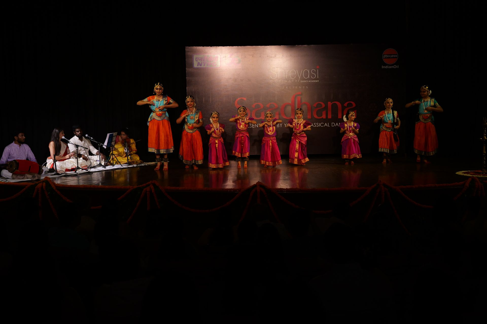

**Saadhana 2025**'s fifth performance was **Ganesh Pancharatna**. 

Based on Lord Ganesha, this is the first piece taught to the little ones a few months after they've begun learning their steps.
  

_Performed by **Aashvi, Adhyanshi, Anoosha, Anvira, Arnika, Inaya, Rabaani, Saanvi**, and **Veda**._


  
  
  
  
  
  
  
  
  
  
  
  
  

_**Moments from the performance**_
 


_**Snaps of the felicitation**_
 
 


  
  
  
  

_**Some glimpses from backstage**_
