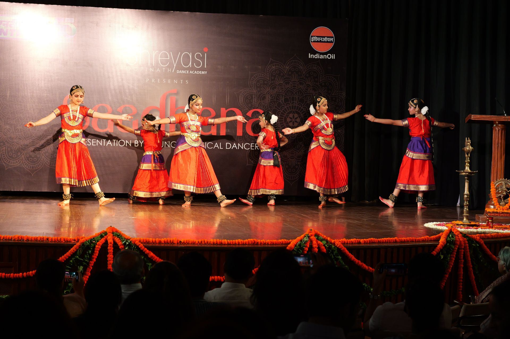
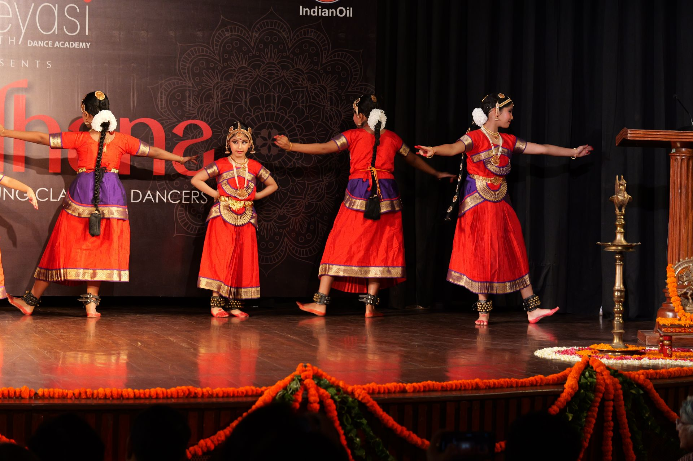
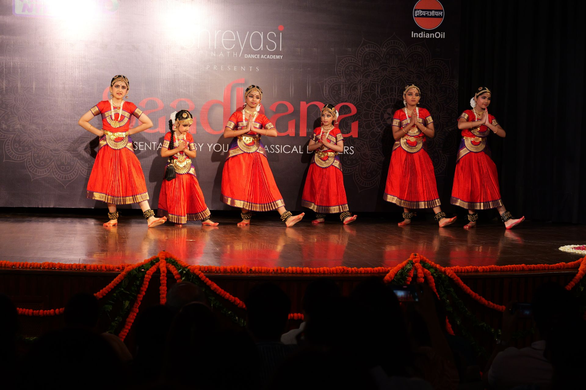
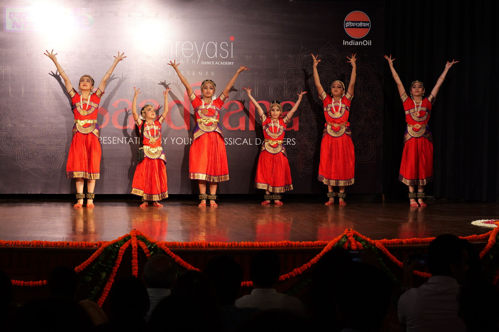
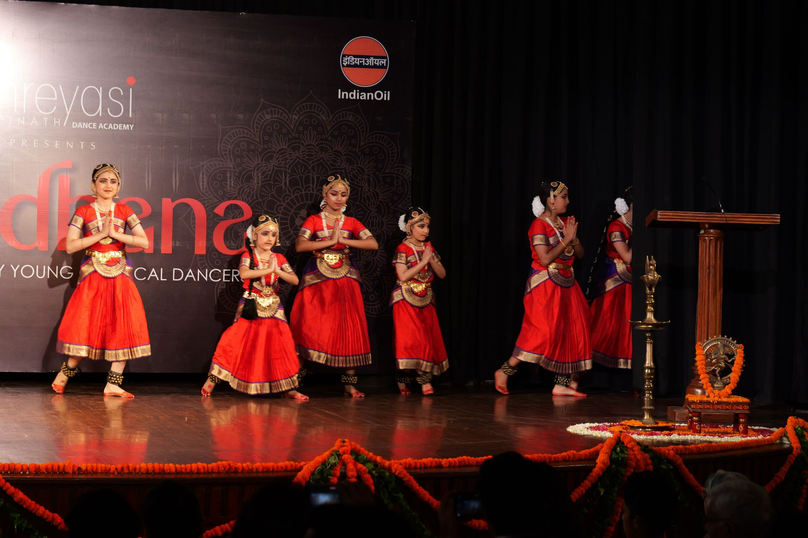

**Saadhana 2025**'s opening piece was **Nottuswaram**, composed by Muthuswami Dikshitar.  

 
With a unique Western touch, its simple phrases make it easily understandable, musically and emotionally. The piece focuses on Ganesha, the son of Parvati and Shiva, who increases knowledge, and whose _vaahan_ is the mouse. 


_Performed by **Amyra, Gaura, Naira, Naomika, Sharanya** and **Tiyasha.**_

 

 



  
  
  
  
  

_**Moments from the performance**_


_**Snaps of the felicitation**_
 
 