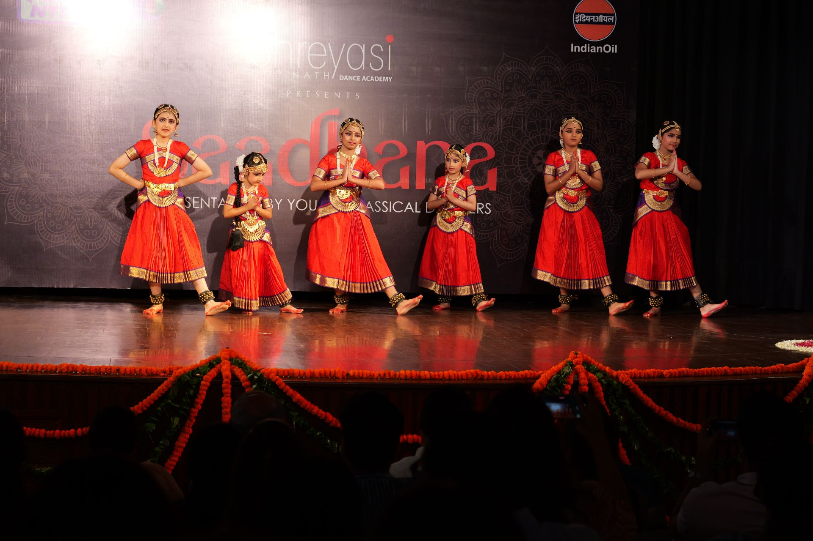

**Saadhana 2025**'s opening piece was **Nottuswaram**, composed by Muthuswami Dikshitar. 
 
With a unique Western touch, its simple phrases make it easily understandable, musically and emotionally. The piece focuses on Ganesha, the son of Parvati and Shiva, who increases knowledge, and whose _vaahan_ is the mouse. 

_Performed by **Amyra Duggal, Gaura Madan, Naira Rastogi, Naomika Agarwal, Sharanya Batra** and **Tiyasha Saha.**_
  


  
  
  
  
  

_**Moments from the performance**_


_**Snaps of the felicitation**_
 
 


  
  
  

_**Some glimpses from backstage**_

