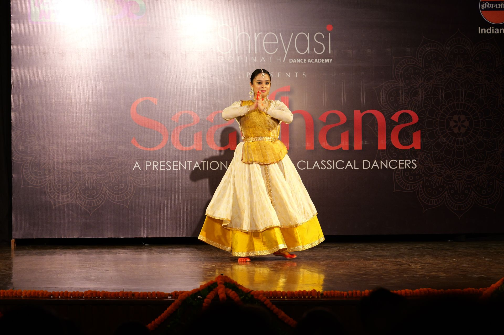
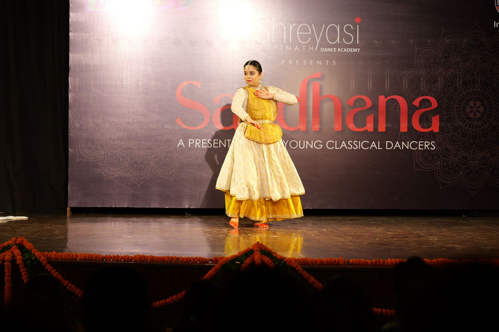
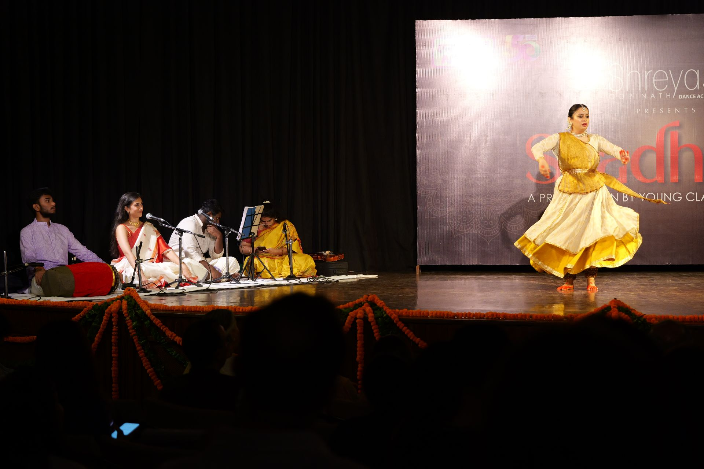
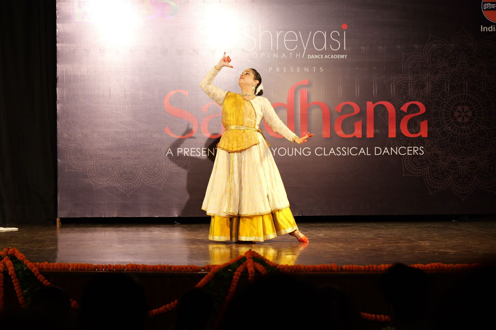
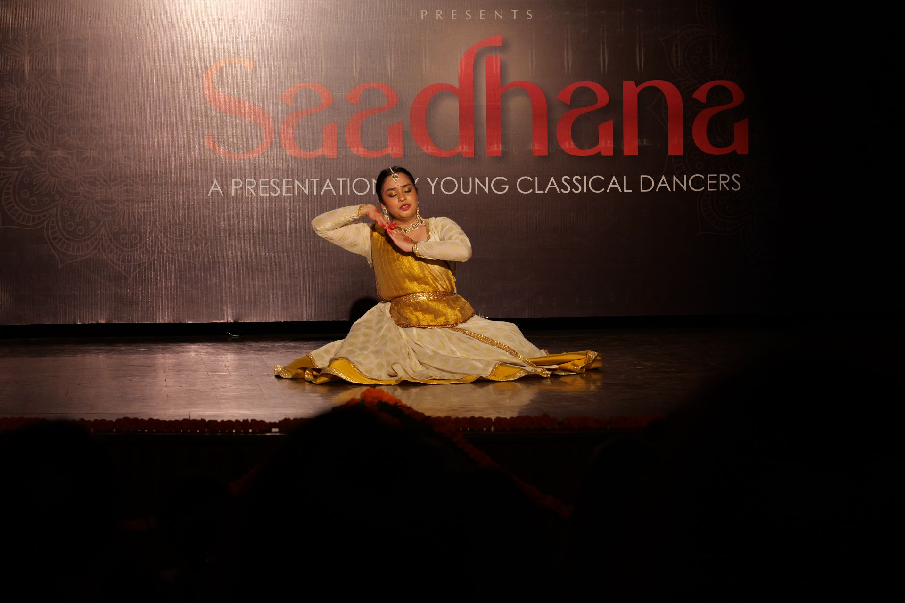

**Saadhana 2025** continued our tradition of inviting young artists from a senior Guru’s school, to present a different art form and showcase their talen. Such an experience enriches the audience’s immersion in dance, and expands the horizons for parents and family too.

The second presentation by guest artists this year was of **Kathak**, performed by [**Nrityashri Alaknanda ji**](#nrityashri-alaknanda)'s student [**Nandini Khattar**](#nandini-khattar).

Nandini presenting two pieces, _Shankara Shri Mahadeva_ and a piece on Lord Krishna.

  
  
  
  
  

 _**Moments from the performance**_

_**Snaps of the felicitation**_
 
 

### Nandini Khattar [](https://www.instagram.com/nandini_khattar/)


Nandini Khattar has been a disciple of Guru Nrityashri Alaknanda since 2011, and is a senior dance teacher at the Alaknanda Institute for Performing Arts. She has had the privilege of performing alongside her Guru on prominent international stages, in Bulgaria (2013), Poland (2015), Paris (2017), London (2018) and more.

As a senior member of her Guru's troupe, Alaknanda Sanskriti, Nandini has performed at Delhi's premier venues. Beyond ensemble productions, she has also established herself as a solo performer.

Nandini credits her Bachelor's degree in Applied Psychology with enriching her understanding of the expressive aspects of dance.


_Follow **Nandini Khattar** on_ [_Instagram_](https://www.instagram.com/nandini_khattar)

 

## Nrityashri Alaknanda [](https://www.instagram.com/alaknandainstitute/) [](https://www.youtube.com/@alaknandakathak975)

Alaknanda Dasgupta is a distinguished Kathak exponent and art motivator, with a career spanning four decades. She has represented India
at global cultural events and curated independent dance festivals across the country. In 2019, her contribution to Kathak was internationally recognized, when she was honoured with the prestigious 'Honors Gratis' award by the President of Krakow, Poland. 

She has also been awarded with several prestigious titles, including Sringarmani, Best Dancer by Sahitya Kala Parishad, and Nrityashri. 

Her organization, the **Alaknanda Institute for Performing Arts, Noida** [](https://www.instagram.com/alaknandainstitute/) [](https://www.youtube.com/@alaknandakathak975) has nurtured young artists for more than three decades.

A graduate of Kathak Kendra (National Institute of Kathak), Alaknanda trained for 14 years with Smt. Reba Vidyarthi, Smt. Bharti Gupta, and
Guru Munna Shukla. Her deep-rooted training and dedication led her to become an integral part of Pandit Birju Maharaj ji's choreographies, performing Krishna in 'Krishnayana', 'Meera', 'Holi' and many more.

A cancer survivor, Alaknanda's resilience and passion for dance gave her the strength to perform 15 shows amidst 6 chemotherapy sessions, 12 of which were for the Election Commission, New Delhi, as a State Icon. Her artistic journey continues to inspire and uplift, leaving an indelible mark on the world.


_Follow **Nrityashri Alaknanda** on_ [_Instagram_](https://www.instagram.com/alaknandainstitute/) _and_ [_YouTube_](https://www.youtube.com/@alaknandakathak975)

