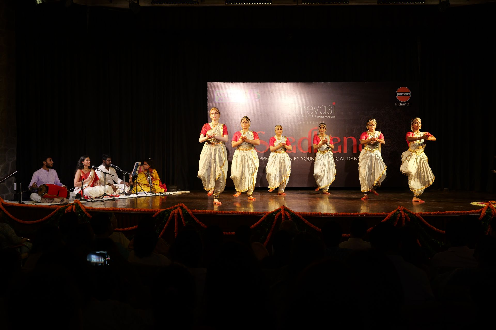
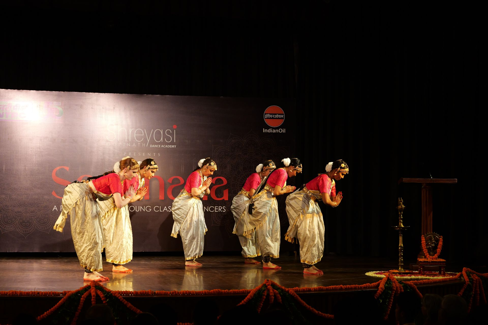
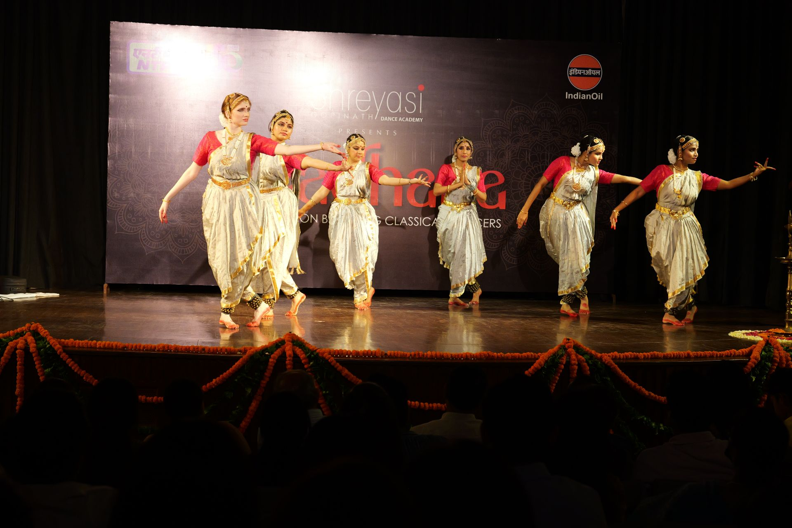
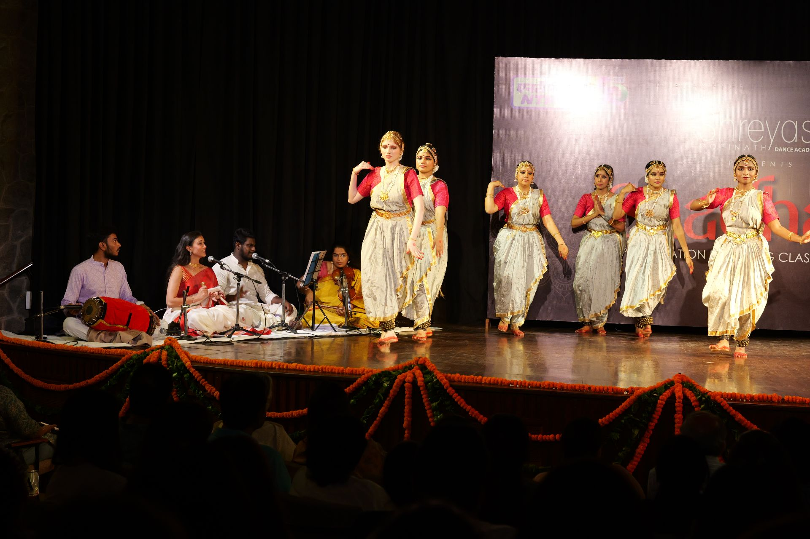
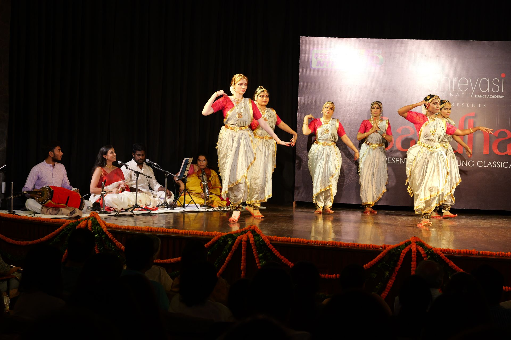
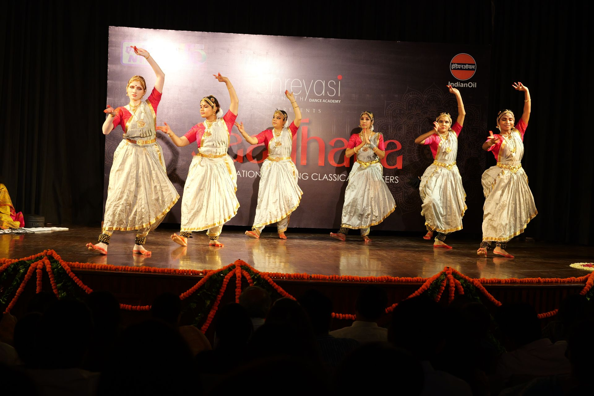
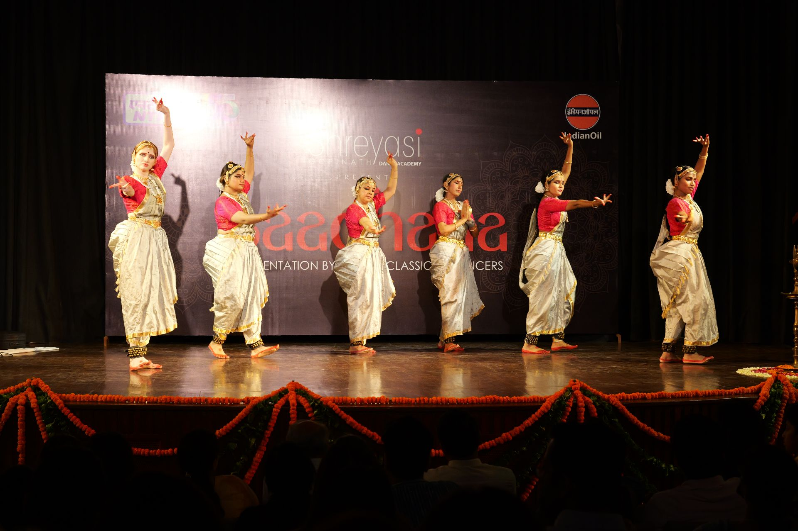
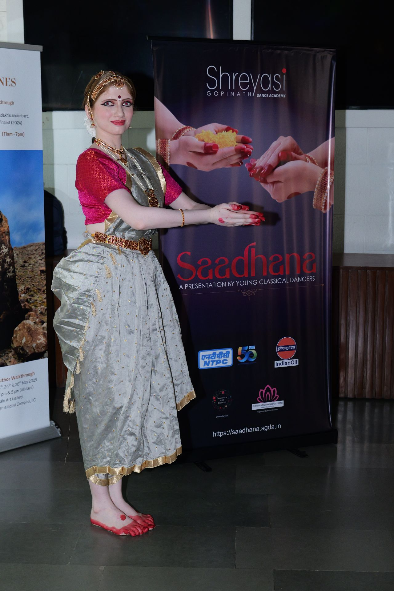

**Saadhana 2025**'s third performance was a **Pushpanjali**, literally meaning _an offering of flowers_.

The piece is notable for its pure steps and for incorporating very little expression.

It was performed by adult students of the academy, each in demanding professions, who learn dance purely out of love for the art form.

_Performed by **Abhirami Renuka Devi, Radhika Anand, Riya Singh, Ruhbani Singh, Tushti Mukherjee** and **Vidhi Jain**._


  
  
  
  
  
  
  

_**Moments from the performance**_
 


_**Snaps of the felicitation**_
 
 


  

_**Some glimpses from backstage**_