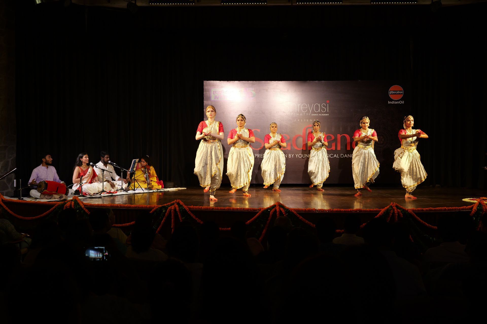
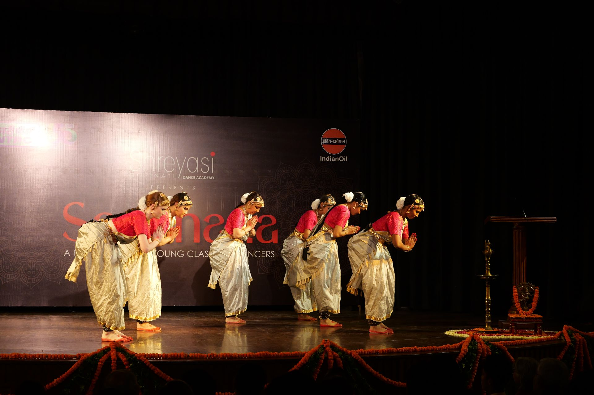
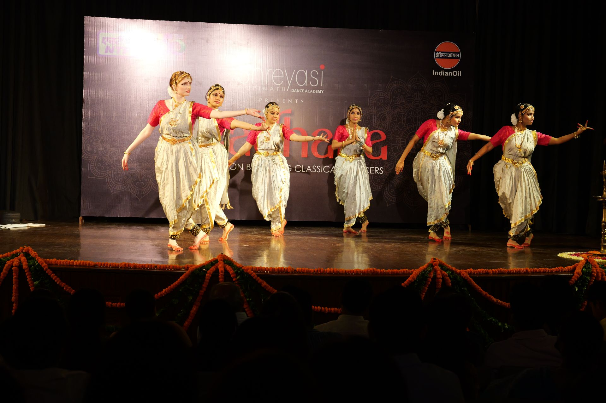
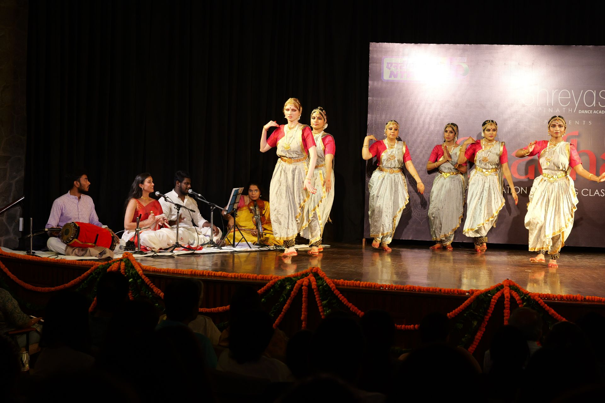

**Saadhana 2025**'s third performance was a **Pushpanjali**, literally meaning _an offering of flowers_. The piece is notable for its pure steps and for incorporating very little expression.
  



_Performed by **Abhirami, Radhika, Riya, Ruhbani, Tushti** and **Vidhi**._

 

 

 

  
  
  
  

_**Moments from the performance**_
 


_**Snaps of the felicitation**_
 
 