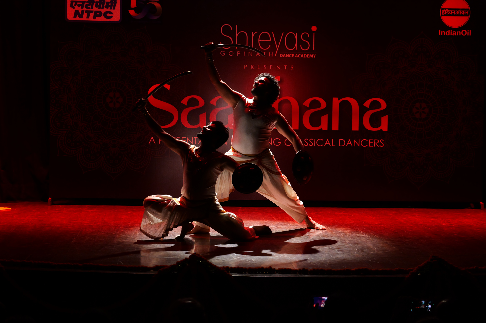
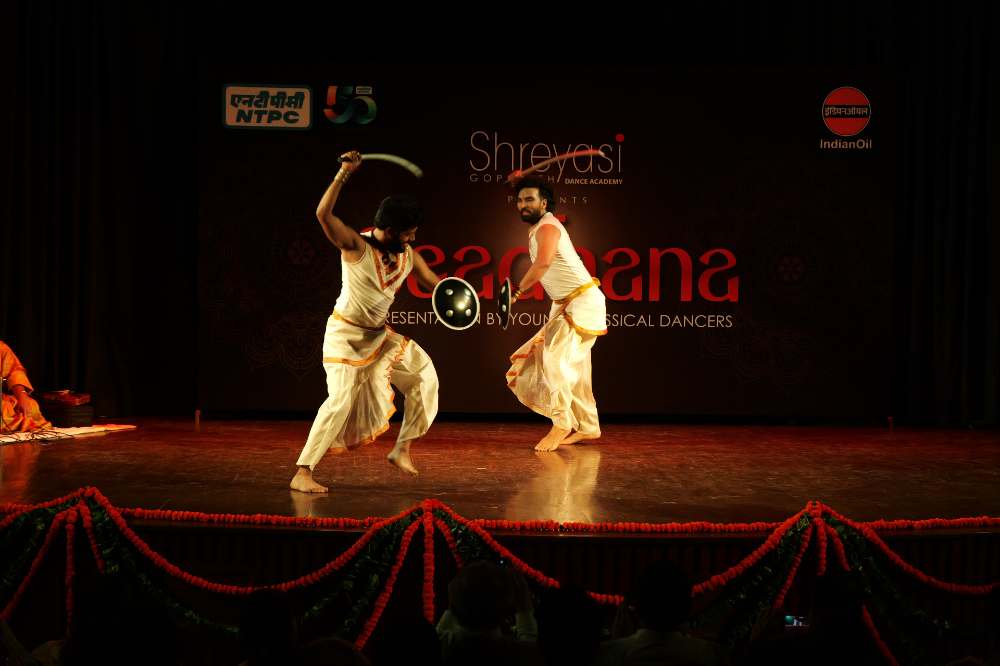
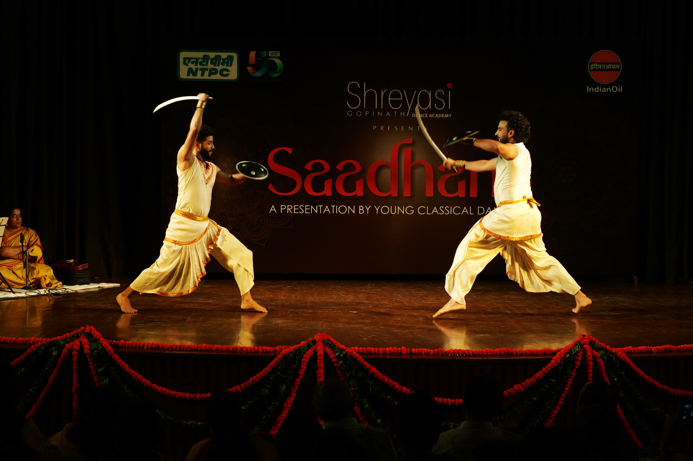
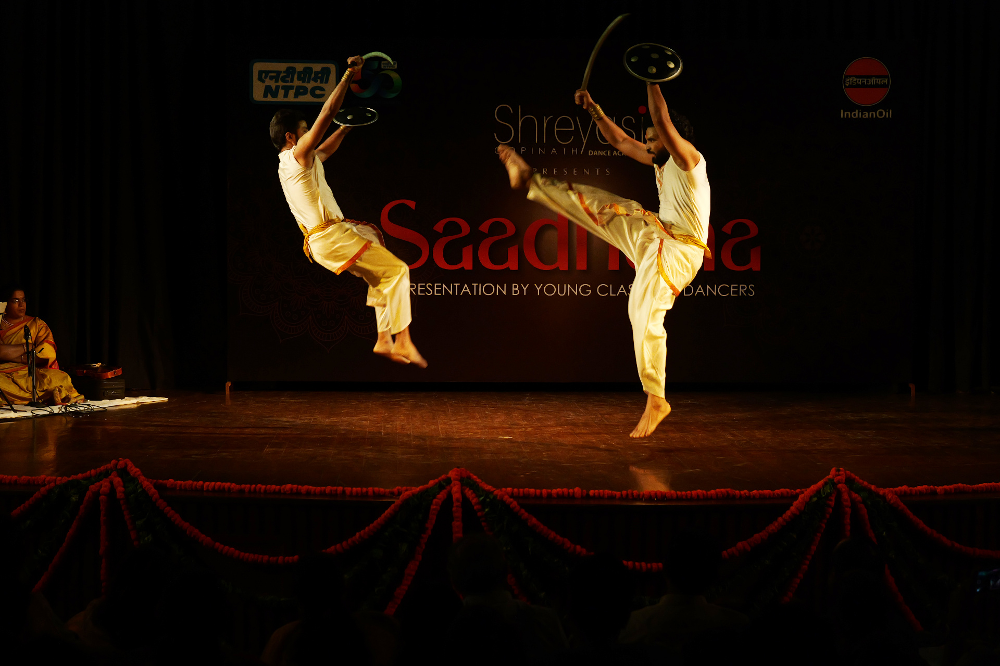
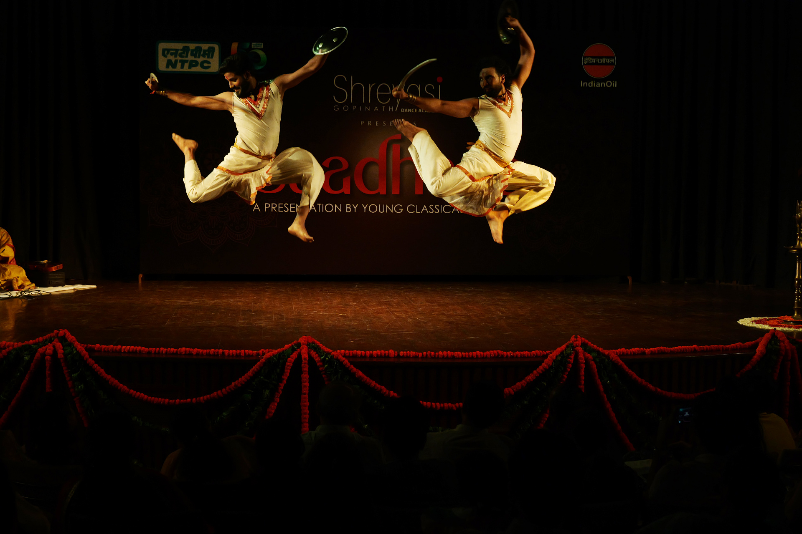

**Saadhana 2025** continued our tradition of inviting young artists from a senior Guru's school, to present a different art form and showcase their talen. Such an experience enriches the audience's immersion in dance, and expands the horizons for parents and family too.

The first presentation by guest artists this year was of **Chhau**, performed by [**Guru Santosh Nair ji**](#santosh-nair) and his students [**Sudhir Kumar**](#sudhir-kumar) and [**Himesh Parcha**](#himesh-parcha).

From a family of artists, Guru Santosh Nair ji is trained in both traditional and contemporary dance forms. He established [**Sadhya**](https://sadhya.com), his dance company, 27 years ago. Experimental work and innovative choreography are Guru Santosh Nair's forte, and he has conducted performances, choreography, and workshops at national and international levels.

The performance **_Yodha_** is a war dance of **Mayurbanj Chhau**, performed in a mood parallel to that of _Thandav Bhava_ in the _Hatiyar Dhar_ style. Saluting the spirit of courage, the dance brings forth the highly charged mood of the warrior.
 
 

  
  
  
  
  

_**Moments from the performance**_


_**Snaps of the felicitation**_

### Sudhir Kumar [](https://www.instagram.com/sudheer.kumar174) [](https://www.facebook.com/sudheer.kumar.5011516)


**Sudhir Kumar joined Sadhya in 2011** and has been training in **Mayurbhanj Chhau and Contemporary Dance under Santosh Nair**. 

He has performed in numerous Sadhya productions, like 'The Game of Dice', 'Unbounded', and 'The Mystical Forest', at events like the CII Conference Tanzania, World Dance Day (2013-19), Festival Of India in Budapest, and for the Centenary Celebration of Amala Shankar in Kolkata. In 2019, under the aegis of ICCR, he performed in Vietnam and Philippines with Sadhya.

Apart from assisting in the choreography of numerous Sadhya productions, **he has choreographed dance pieces himself**, in the Mayurbhanj Chhau and Contemporary Dance styles.


_Follow **Sudhir Kumar** on_ [_Instagram_](https://www.instagram.com/sudheer.kumar174) _and_ [_Facebook_](ttps://www.facebook.com/sudheer.kumar.5011516)

 

### Himesh Parcha [](https://www.instagram.com/himeshparcha/) [](https://www.facebook.com/himesh.parcha/)


**Himesh Parcha joined Sadhya in 2011** and has been **training in Mayurbhanj Chhau and Contemporary Dance** under **Santosh Nair**.

He has performed in numerous Sadhya productions, like 'The Game of Dice', 'Unbounded', and 'The Mystical Forest', at events like the South Asian Rotary Summit, World Dance Day (2013-19), the Festival of India in Budapest, and for the Centenary Celebration of Amala Shankar in Kolkata. In 2019, under the aegis of ICCR, he performed in Vietnam and Philippines with Sadhya.


_Follow **Himesh Parcha** on_ [_Instagram_](https://www.instagram.com/himesh.parcha) _and_ [_Facebook_](ttps://www.facebook.com/himesh.parcha)

 

## Shri Santosh Nair [](https://www.instagram.com/santosh.sadhya) [](https://www.youtube.com/@sadhyadance) [](https://www.sadhya.com)



Santosh Nair comes from a family of artists and is trained in both traditional and contemporary dance forms. He established Sadhya, his dance company, 27 years ago.

Experimental work and innovative choreography are Santosh Nair's forte, amd have helped him carve out a niche for himself in the field. He has conducted Performances, Choreography and
Workshop at the National and International levels. His productions, like 'The Game of Dice' and 'The Mystical Forest', exemplify a beautiful blend of creativity and tradition.

He has been awarded PHD Art & Culture Samman, Atal Behari Vajpayee Lifetime Achievement Award, and recently, the Guru Samman Award, for his invaluable contribution to the field of dance.


_Follow **Guru Santosh Nair** on_ [_Instagram_](https://www.instagram.com/santosh.sadhya) _and_ [_YouTube_](https://www.youtube.com/@sadhyadance), and [_visit Sadhya Dance Company_](https://sadhya.com)

