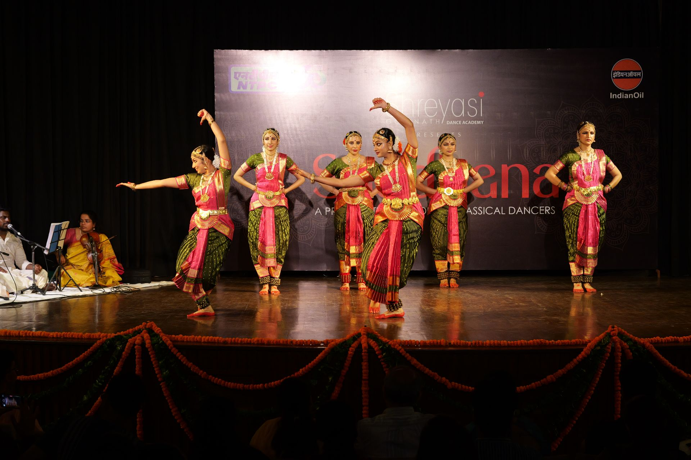
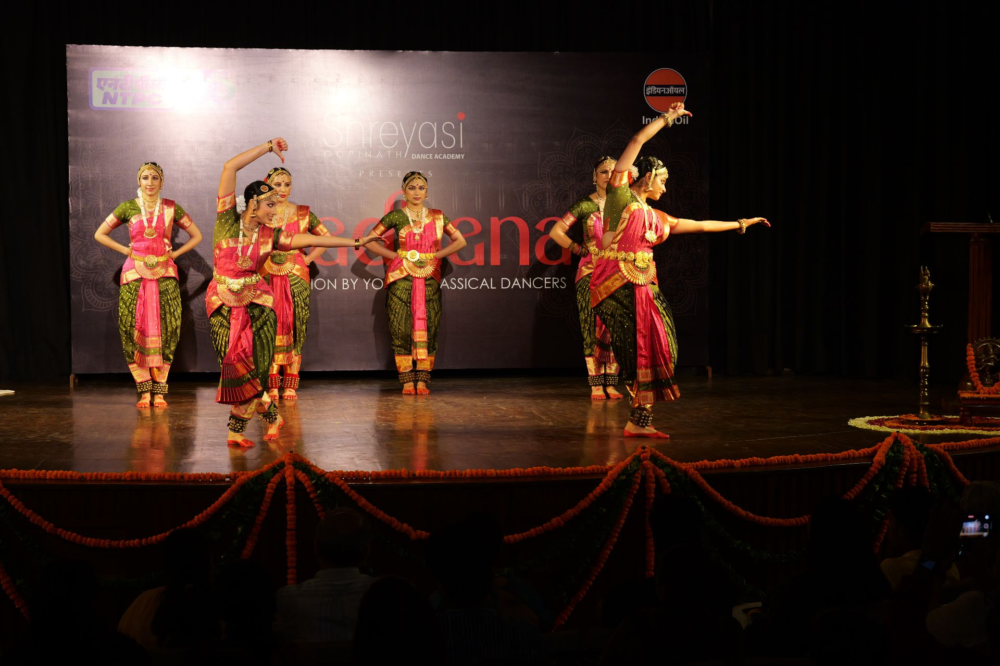
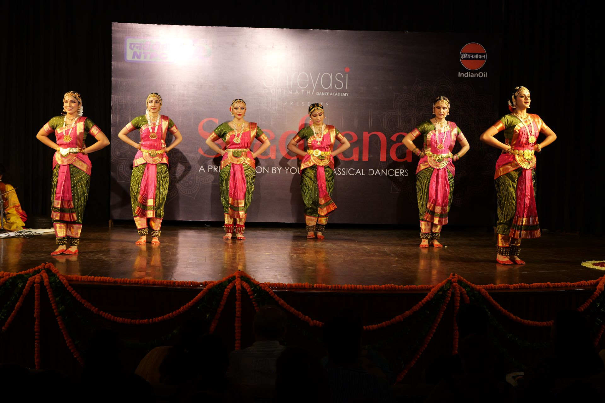
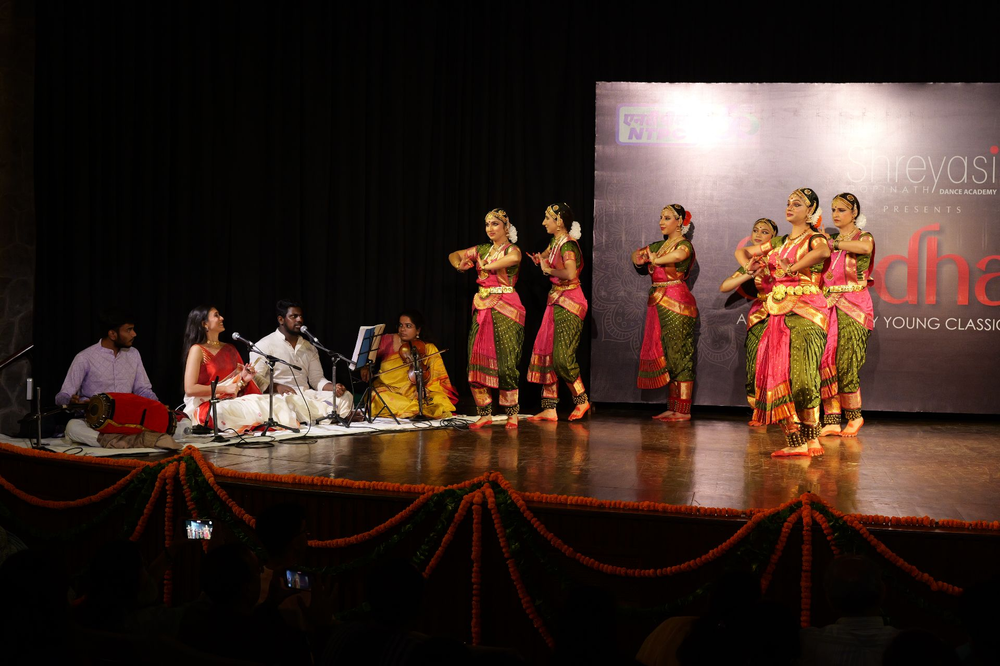
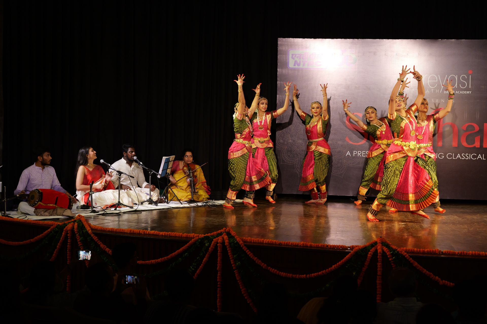
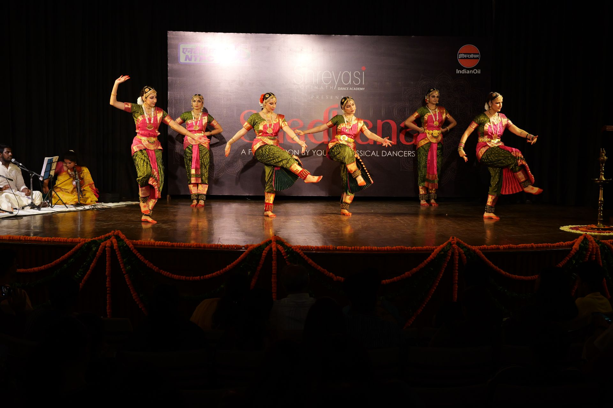
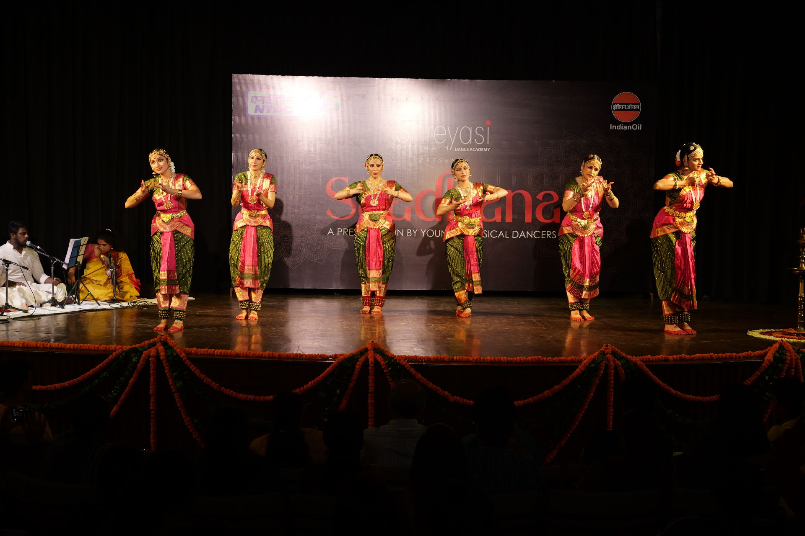
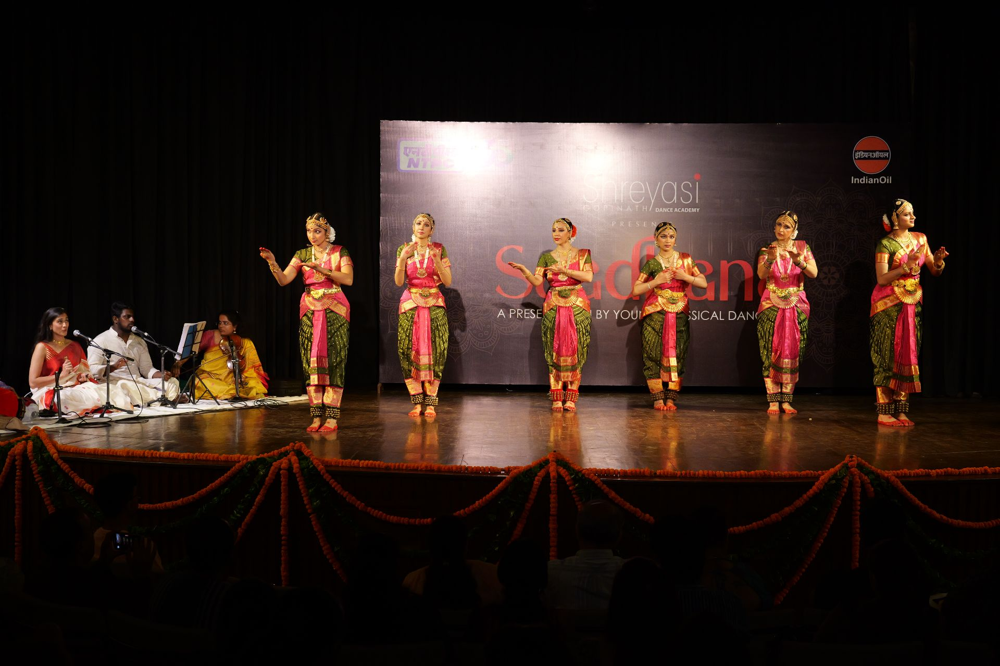
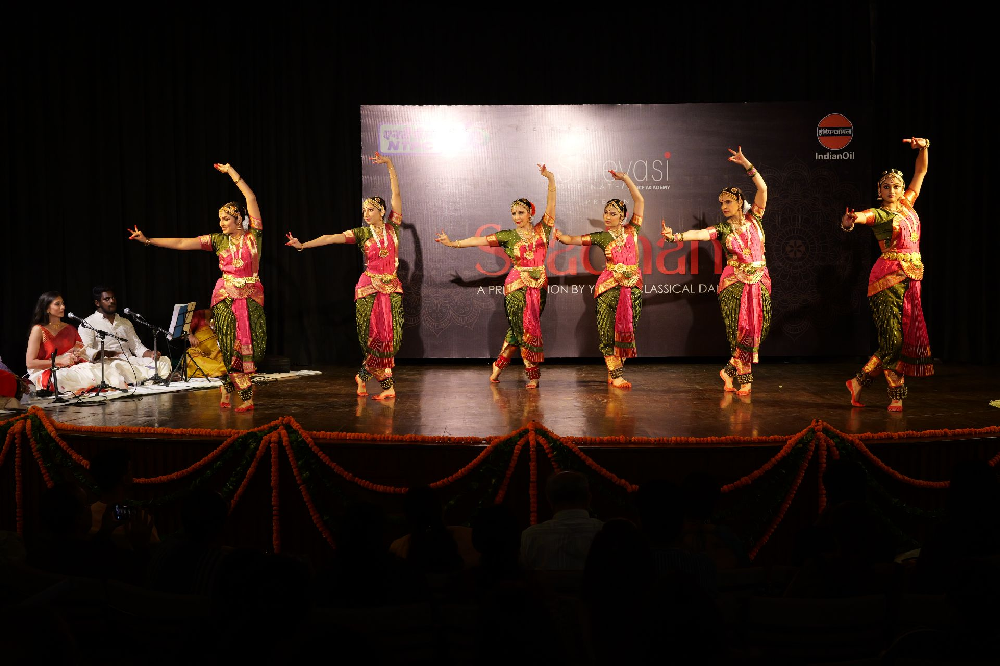
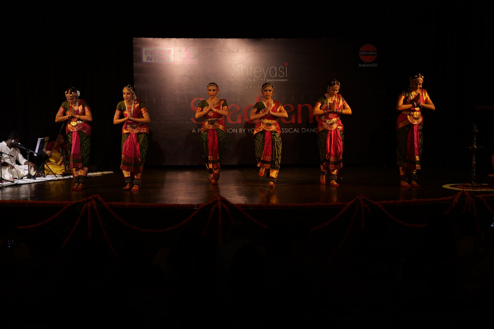

The **Thillana** is usually the finale in a Bharatanatyam repertoire. Being very fond of Krishna, we chose numerous pieces on him for Saadhana 2025, and this meant the sequencing of performances required some adaptation. Beyond our affection for Krishna, we find that our students, children or older, seem to instictively understand his लीलाs easily.

In this piece, the devotee says, **"Padmanabha, oh Lord Padmanabha, oh my beloved Lord Padmanabha, तुम्हारी लीला! You remove all worries and miseries... Please come to me quickly!"**

Composed by Maharaja Sri Swathi Thirunal Rama Varma III of Travancore, it is ordered through rhythmic movements, and features minimal expressions.

_Performed by **Aatmika, Athira, Mithuna, Sarada, Sunayna** and **Vidushi**._


  
  
  
  
  
  
  
  
  
  

_**Moments from the performance**_
 


_**Snaps of the felicitation**_
 
 