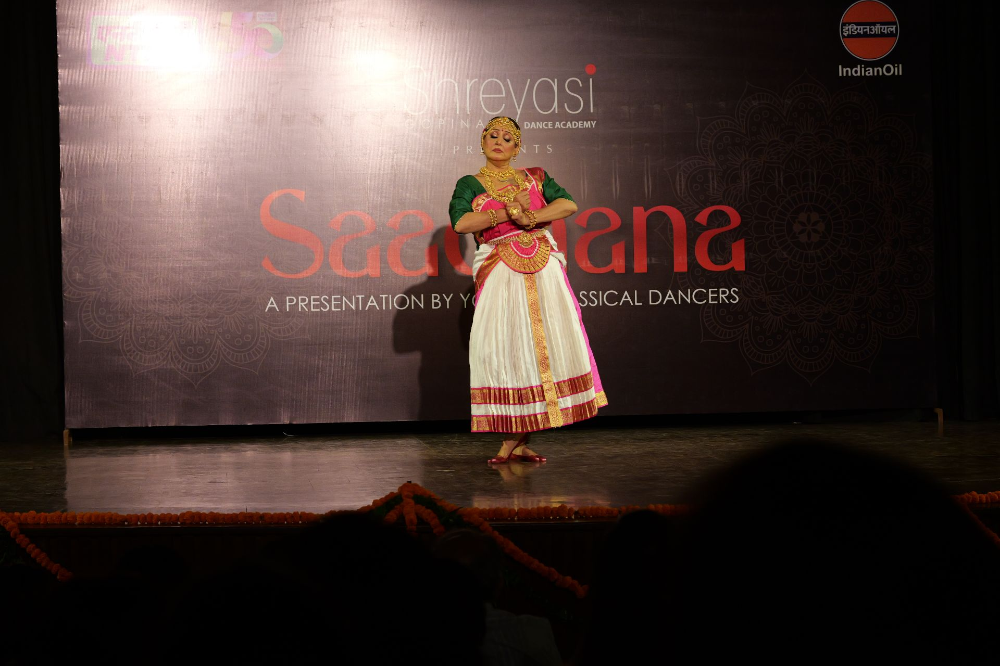
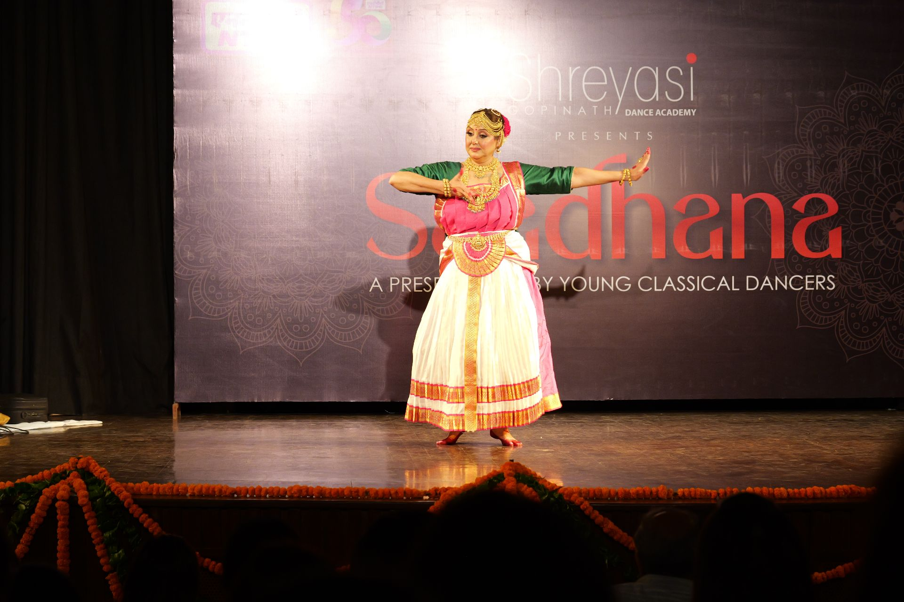
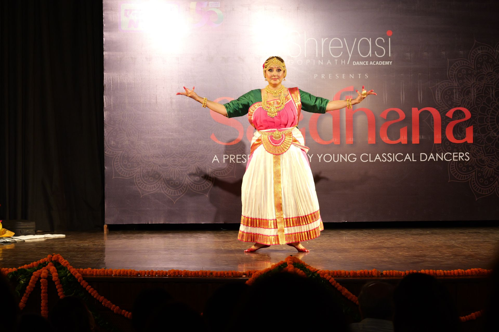
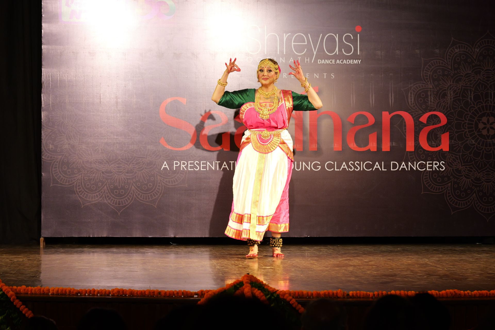

**Saadhana 2025**'s ninth performance was a **Varnam**.

An excerpt from one of the central pieces in a Bharatanatyam recital, in this piece the heroine is craving attention from Lord Vishnu. The piece describes her emotions and feelings.

_Performed by **Meenakshi Sud Dutt**, one of our senior students._
 
 

  
  
  
  

_**Moments from the performance**_
 

_**Snaps of the felicitation**_
