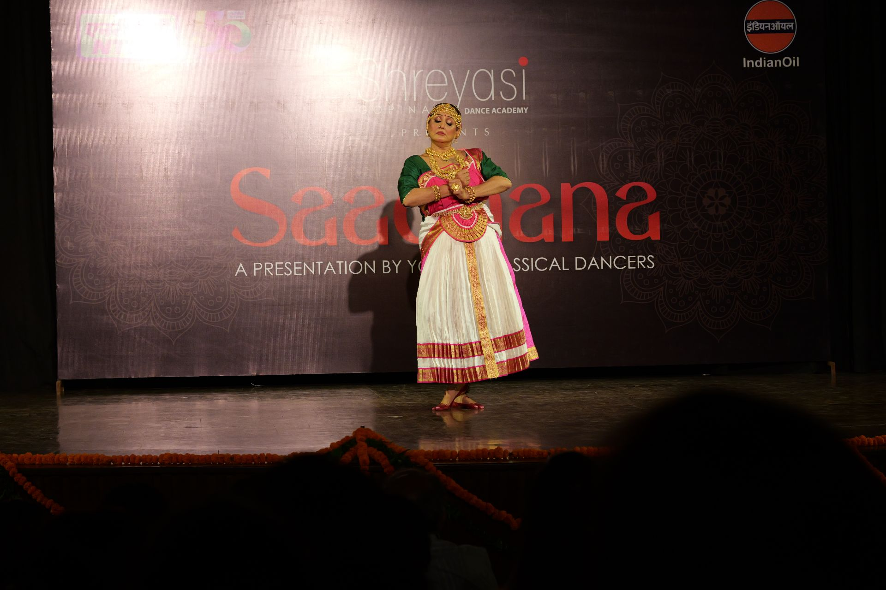
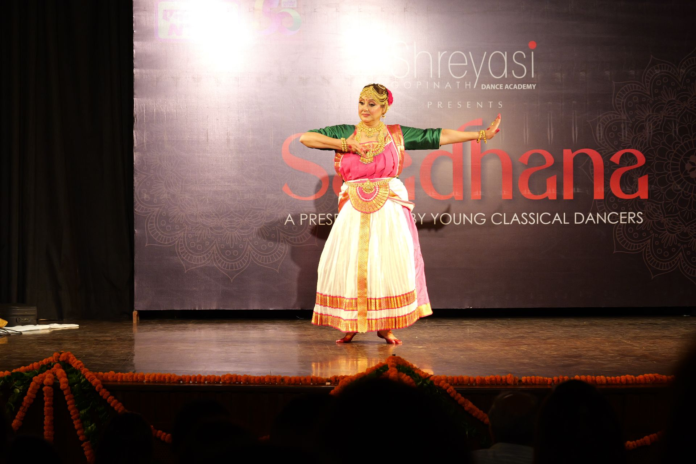
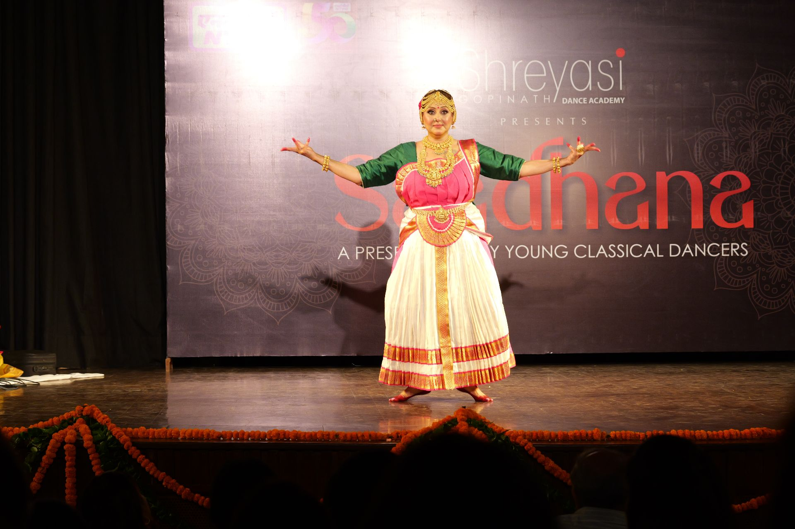
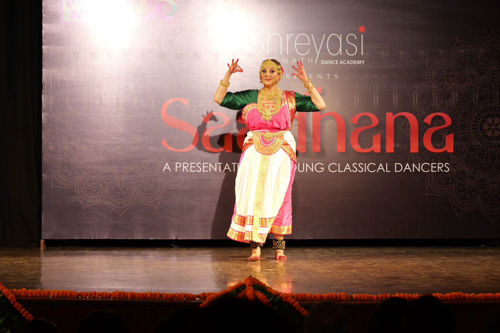

**Saadhana 2025**'s eighth performance was a **Varnam**.

An excerpt from one of the central pieces in a Bharatanatyam recital, in this piece the heroine is craving attention from Lord Vishnu. The piece describes her emotions and feelings. 
 


_Performed by **Meenakshi Sud Dutt**, a working professional who resumed her dance education after a multi-decade gap._

 

 

 

 

 


  
  
  
  

_**Moments from the performance**_
 

_**Snaps of the felicitation**_
